# Praktikum Minggu 01

A. TUJUAN  
1.  Memahami pengertian dasar Git dan GitHub.
2.  Melakukan instalasi Git pada komputer.
3.  Melakukan konfigurasi identitas pengguna pada Git.
4.  Membuat repository pada GitHub.
5.  Menghubungkan repository GitHub dengan repository lokal.
6.  Memahami proses clone, add, commit, push, dan pull.
7.  Memahami penggunaan branch untuk mengembangkan suatu perubahan secara lebih aman.
8.  Memahami cara membuat dan mengelola repository pribadi.
9.  Memahami pengelolaan repository yang berada dalam organisasi.
10.  Memahami konsep fork dan Pull Request.
11.  Memahami proses kolaborasi menggunakan Git dan GitHub.
12.  Mengetahui cara melakukan sinkronisasi perubahan antara repository lokal dan repository GitHub.

B. DASAR TEORI
  
1. Pengertian Git
Git merupakan sistem pengendalian versi atau Version Control System (VCS) yang digunakan untuk mencatat perubahan pada file dari waktu ke waktu. Git dapat digunakan untuk mengelola source code, dokumentasi, maupun berbagai jenis dokumen digital.
Git bekerja secara terdistribusi sehingga repository dapat disimpan pada komputer lokal dan dapat dihubungkan dengan repository remote seperti GitHub. Dengan sistem tersebut, perubahan yang dilakukan oleh pengguna dapat dicatat dalam bentuk commit sehingga riwayat perubahan dapat diketahui.
Git merupakan perangkat lunak open source dan dapat digunakan melalui command line maupun berbagai aplikasi dengan antarmuka grafis.
2. Pengertian GitHub
GitHub merupakan platform berbasis web yang digunakan untuk menyimpan repository Git secara online. GitHub tidak hanya digunakan sebagai tempat menyimpan source code, tetapi juga menyediakan fasilitas untuk bekerja sama seperti branch, issue, Pull Request, review, dan pengelolaan collaborator.
Repository GitHub dapat dibuat dengan status public maupun private. Repository public dapat dilihat oleh pengguna lain, sedangkan repository private hanya dapat diakses oleh pengguna yang memiliki izin.

C. PEMBAHASAN LISTING  

PRAKTIK  

PRAKTIK 1 – INSTALASI GIT

1. Persiapan
Materi yang diamati menyediakan beberapa pilihan instalasi Git. Untuk Windows, instalasi dilakukan menggunakan installer Git for Windows. Setelah instalasi selesai, keberhasilan instalasi dapat diperiksa menggunakan perintah git --version.

2. Download Git
Git dapat diunduh dari website resmi Git.
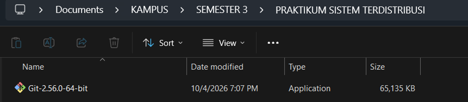
Setelah installer berhasil diunduh, jalankan file installer tersebut dengan melakukan double click.

3. Proses Instalasi
Pada halaman awal installer, klik:
Next
Kemudian tentukan lokasi instalasi Git. Jika tidak ada kebutuhan khusus, lokasi default dapat digunakan.
Selanjutnya akan muncul pilihan komponen. Pada tahap ini dapat menggunakan pilihan default.
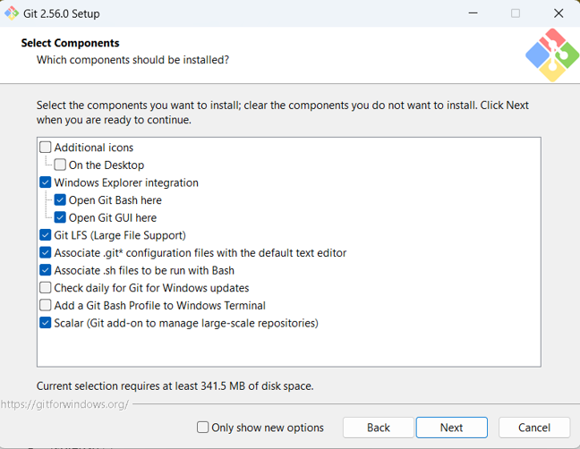

4. Memilih Text Editor
Git membutuhkan text editor yang dapat digunakan ketika Git memerlukan editor untuk membuat pesan atau konfigurasi tertentu.

Beberapa editor yang dapat digunakan antara lain:
•	Visual Studio Code
•	Notepad++
•	Vim
•	editor lainnya.
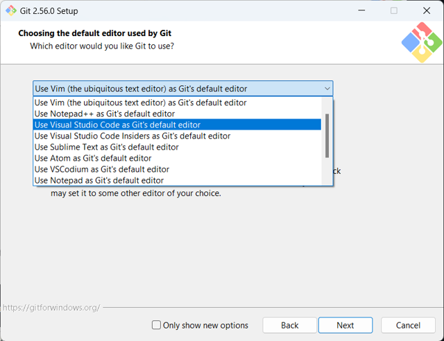
Untuk mahasiswa Informatika, Visual Studio Code dapat dipilih karena lebih mudah digunakan untuk mengedit source code.

5. Menentukan Nama Branch Utama
Pada instalasi Git terdapat pilihan nama branch awal.
Branch utama dapat menggunakan:
Main
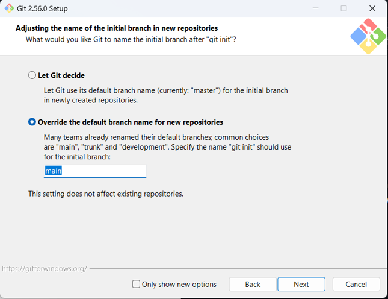
Penggunaan main sesuai dengan kebiasaan repository GitHub modern dan juga digunakan dalam materi praktikum.

6. Menentukan PATH Git
Pada pilihan penggunaan Git dari command line, gunakan pilihan yang memungkinkan Git digunakan dari command prompt maupun Git Bash.
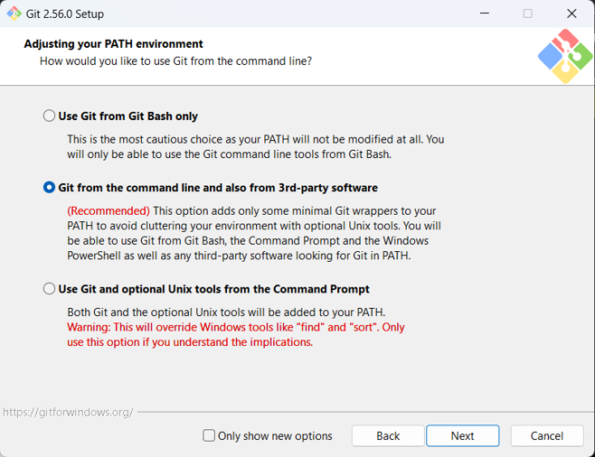
Dengan demikian, Git dapat dijalankan melalui beberapa terminal di Windows.

7. HTTPS
Untuk koneksi repository GitHub, Git dapat menggunakan HTTPS.
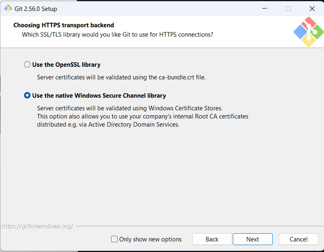
Pada installer Git for Windows, gunakan pilihan library HTTPS yang direkomendasikan oleh installer.

Pilih pilihan pertama untuk konversi akhir baris (CR-LF).

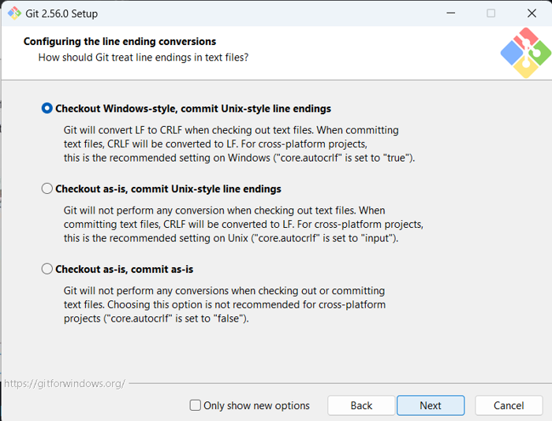

Pilih MinTTY untuk terminal yang digunakan untuk mengakses Git Bash.

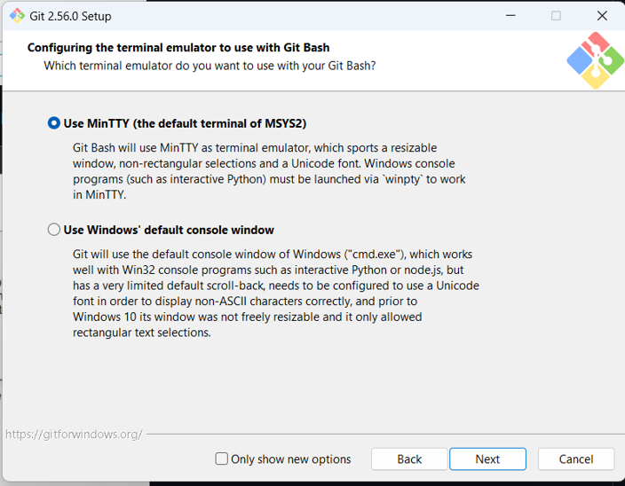

Tetapkan perilaku standar dari git pull. Pilih default saja yaitu Fast-forward or merge. Arti dari hal ini akan dipelajari pada proses pembelajaran lanjutan.

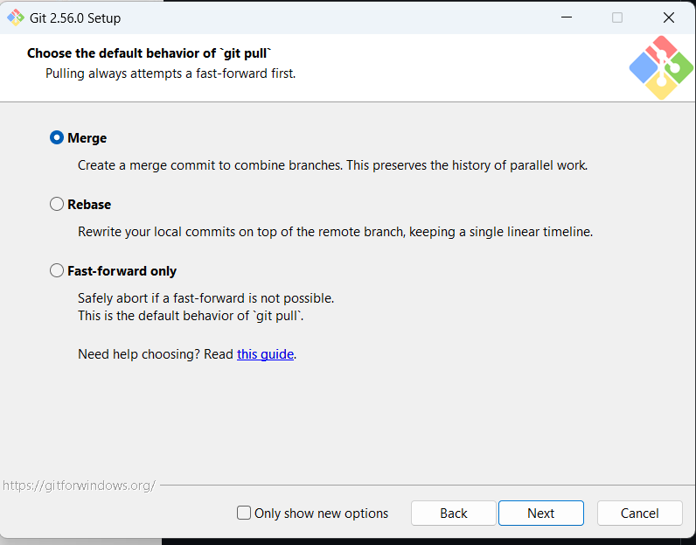

Memilih credential helper.

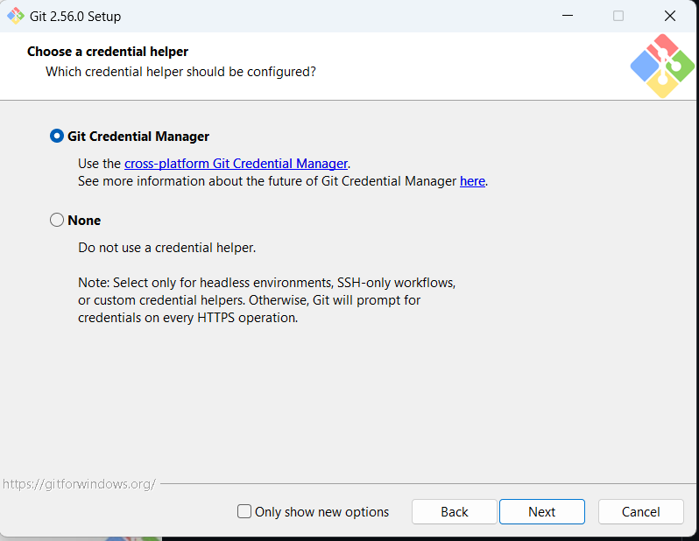

Untuk opsi ekstra, pilih serta aktifkan file system caching.

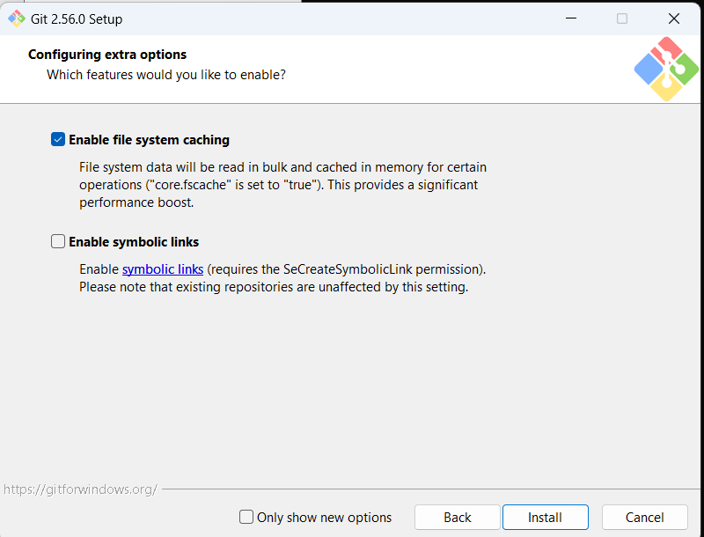

8. Penyelesaian Instalasi
Setelah seluruh konfigurasi selesai, klik:
Install
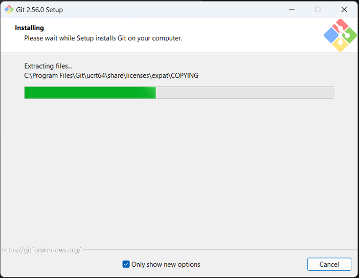

Tunggu hingga proses instalasi selesai kemudian klik:
Finish

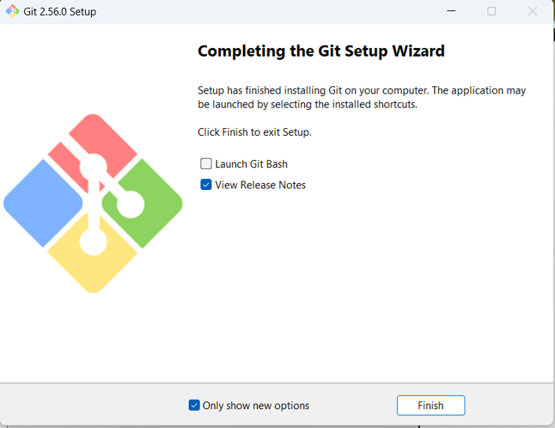

9. Mengecek Instalasi
Buka CMD kemudian jalankan:
Git :

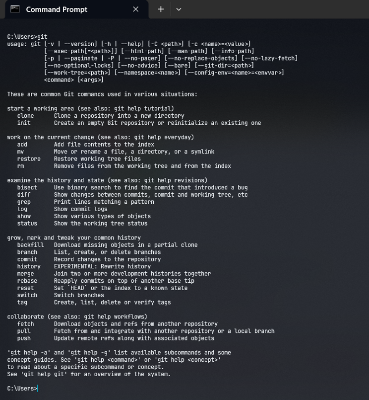

Lihat versi dari Git git –version :

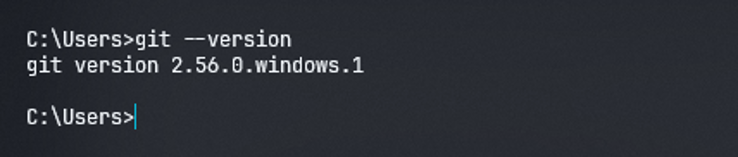

Versi yang muncul dapat berbeda tergantung versi Git yang terpasang pada komputer.
Penjelasan:
Perintah git --version digunakan untuk mengetahui versi Git yang sedang terpasang. Jika nomor versi muncul, berarti Git telah berhasil terinstal dan dapat digunakan.
