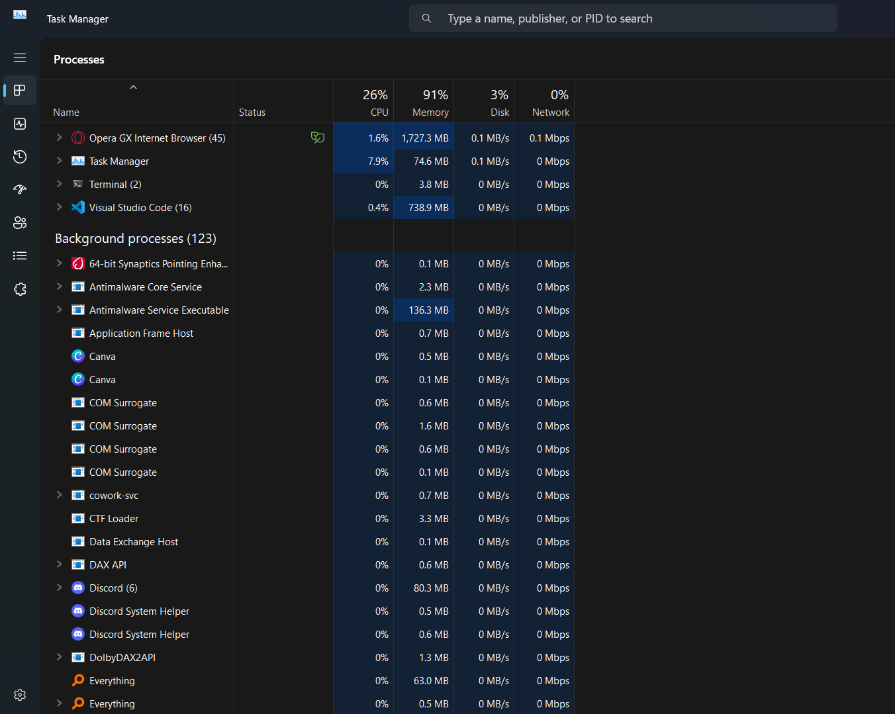
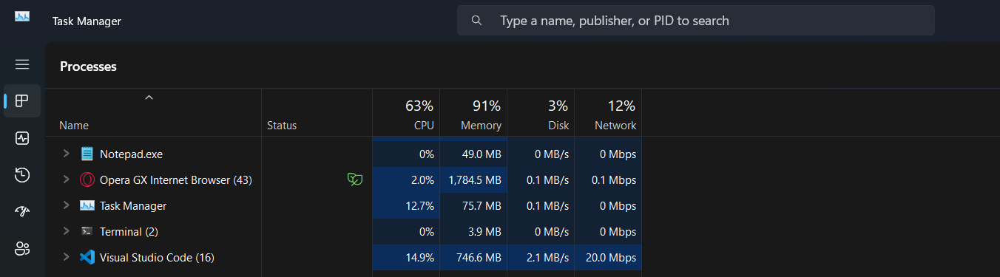
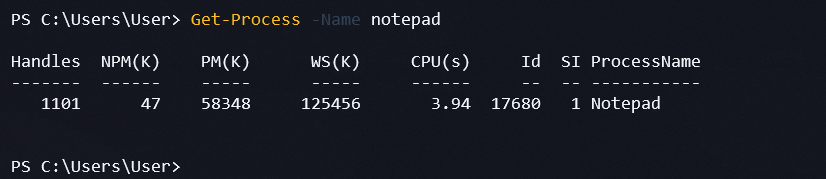
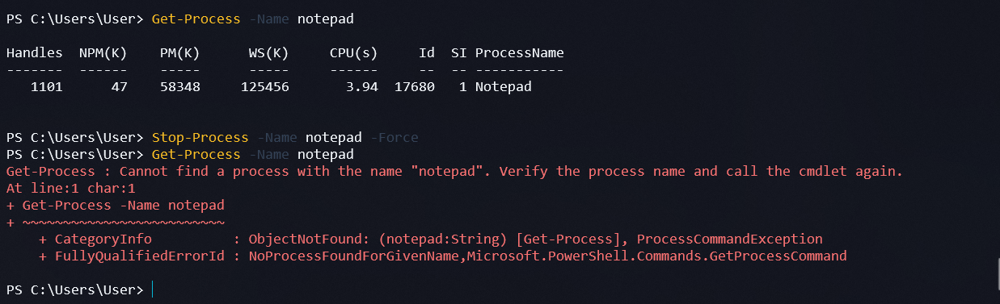

# Praktikum Minggu 02
MODUL 2 — KOMUNIKASI ANTAR PROSES PADA SISTEM TERDISTRIBUSI
# A. Tujuan Pembelajaran

Tujuan pembelajaran berikut disusun berdasarkan materi dan tugas dalam modul :

Memahami konsep proses (process) dalam sistem operasi.
Mengamati proses yang sedang berjalan pada sistem operasi Windows.
Memahami cara melihat, me-restart, dan menghentikan proses aplikasi.
Memahami perbedaan komunikasi antarproses pada satu komputer dan pada sistem terdistribusi.
Memahami konsep komunikasi antara client dan server menggunakan GraphQL.
Membuat lingkungan pengembangan Python menggunakan uv.
Menginstal dan menggunakan Strawberry untuk menjalankan GraphQL server.
Menjalankan query GraphQL melalui browser.
Membuat client yang dapat mengirimkan query ke GraphQL server dan menerima hasilnya.

# B. Dasar Teori

1. Proses pada Sistem Operasi
Proses merupakan hasil dari eksekusi program atau aplikasi yang bersifat executable. Setiap aplikasi yang dijalankan akan menjadi proses yang dikelola oleh sistem operasi.
Sebuah proses terdiri atas kode program, data, sumber daya (resources), dan informasi mengenai kondisi proses, termasuk stack dan heap.
Pada sistem operasi Windows, proses yang sedang berjalan dapat diamati menggunakan Task Manager. Melalui fitur ini, pengguna dapat melihat aplikasi dan proses yang sedang menggunakan sumber daya komputer.

2. Komunikasi Antarproses pada Satu Node
Pada satu komputer atau node, proses dikelola oleh sistem operasi yang sama. Sistem operasi bertanggung jawab atas eksekusi proses, alokasi sumber daya, pengelolaan proses, dan komunikasi antarproses.
Pengelolaan tersebut sebagian besar berlangsung di belakang layar sehingga pengguna tidak harus mengatur setiap proses secara langsung.

3. Komunikasi Antarproses pada Sistem Terdistribusi
Komunikasi antarproses pada sistem terdistribusi memiliki tantangan yang berbeda dibandingkan komunikasi pada satu komputer.
Dalam sistem terdistribusi, proses dapat berjalan pada node yang berbeda. Setiap node memiliki memori sendiri dan tidak selalu menggunakan clock yang sama. Oleh karena itu, komunikasi membutuhkan mekanisme yang memungkinkan proses bertukar informasi melalui jaringan.
Salah satu pendekatan yang dibahas dalam modul adalah GraphQL, yaitu teknologi yang dapat digunakan client untuk meminta data dari server.

4. GraphQL
GraphQL merupakan teknologi untuk meminta dan menyediakan data melalui sebuah schema yang mendefinisikan operasi serta data yang dapat diakses oleh client.
Dalam praktikum ini, GraphQL digunakan untuk menghubungkan client dengan server. Client mengirimkan query sesuai schema, kemudian server memproses permintaan dan memberikan hasilnya.

5. Strawberry GraphQL
Strawberry merupakan library GraphQL untuk Python. Library ini digunakan untuk mendefinisikan schema dan menyediakan layanan GraphQL menggunakan Python.
Dalam praktikum ini, Strawberry digunakan untuk menjalankan server yang menyediakan data buku. Client akan mengirimkan query untuk meminta judul dan nama penulis buku.

# C. Langkah-Langkah Praktikum
## PRAKTIK 1 — PROSES PADA SATU NODE

Pada bagian pertama, kamu akan mengamati proses yang berjalan di Windows, menjalankan aplikasi, kemudian mencoba me-restart dan menghentikan proses aplikasi tersebut.

### Langkah 1. Membuka Task Manager
Task Manager merupakan fitur Windows yang dapat digunakan untuk melihat proses yang sedang berjalan.

Penjelasan:
Setiap proses memiliki identitas yang dapat digunakan untuk membedakannya dari proses lain. PID merupakan salah satu informasi yang dapat digunakan ketika ingin mengelola proses melalui PowerShell.

### Langkah 2. Menjalankan Aplikasi untuk Diamati
Agar proses yang dihasilkan aplikasi dapat diamati dengan jelas, gunakan aplikasi sederhana seperti Notepad.
Langkah-langkah:
Tekan Windows + R.
Ketik:
notepad
Tekan Enter.
Biarkan Notepad terbuka.
Kembali ke Task Manager.

Penjelasan:
Ketika Notepad dijalankan, Windows membuat proses untuk menjalankan aplikasi tersebut. Proses inilah yang akan diamati pada langkah berikutnya.

### Langkah 3. Memeriksa Proses Menggunakan PowerShell
Selain Task Manager, kamu dapat menggunakan PowerShell untuk memeriksa proses.
Buka PowerShell, kemudian jalankan:

Get-Process -Name notepad
Jika Notepad sedang berjalan, PowerShell akan menampilkan informasi proses tersebut, termasuk PID.

Penjelasan:
Perintah Get-Process digunakan untuk memperoleh informasi proses yang berjalan di Windows.
Parameter -Name notepad membatasi hasil pencarian pada proses dengan nama notepad.

### Langkah 4. Mematikan Proses Aplikasi
Pada langkah ini, akan menghentikan proses Notepad menggunakan PowerShell, bukan melalui tombol Close pada jendela aplikasi.
Pastikan Notepad masih berjalan.
Jalankan perintah berikut:
    Stop-Process -Name notepad -Force
Aplikasi seharusnya sudah berhenti karena prosesnya dihentikan oleh PowerShell.
Kemudian periksa kembali:
    Get-Process -Name notepad
Jika proses sudah tidak berjalan, PowerShell tidak akan menemukan proses Notepad dan dapat menampilkan pesan bahwa proses tersebut tidak ditemukan.

Penjelasan:
Perintah Stop-Process digunakan untuk menghentikan proses yang sedang berjalan. Parameter -Force memaksa proses dihentikan. Karena penghentian paksa dapat menyebabkan data yang belum disimpan hilang, gunakan Notepad kosong untuk praktikum ini.

### Langkah 5. Me-restart Proses Aplikasi
Restart proses berarti menghentikan proses yang sedang berjalan, kemudian menjalankan aplikasi tersebut kembali.
Untuk mempraktikkannya, jalankan perintah berikut di PowerShell:
    Start-Process notepad
Perintah tersebut akan menjalankan Notepad kembali.
Periksa prosesnya:
    Get-Process -Name notepad
Jika proses ditemukan, berarti Notepad sudah berjalan kembali.

Penjelasan:
Langkah tersebut menunjukkan bahwa proses aplikasi dapat dihentikan dan dibuat kembali tanpa menggunakan perintah keluar dari aplikasi melalui antarmukanya.

Screenshot yang perlu disimpan:

Ambil screenshot yang menunjukkan proses Notepad berjalan kembali setelah dihentikan.

Nama file yang disarankan:

05_RestartProses_Notepad.png

Langkah 6. Dokumentasi dan Penjelasan

Setelah semua langkah selesai, pastikan kamu memiliki bukti untuk:

Daftar proses pada Windows.
Proses Notepad ketika sedang berjalan.
Pemeriksaan proses melalui PowerShell.
Penghentian proses Notepad.
Proses Notepad setelah dijalankan kembali.

Pada README.md, jelaskan apa yang kamu lakukan dan hasil yang benar-benar terlihat pada komputer.

Jangan menuliskan hasil yang belum kamu periksa.

PRAKTIK 2 — KOMUNIKASI ANTARPROSES PADA SISTEM TERDISTRIBUSI

Pada bagian ini, kamu akan menggunakan Python dan Strawberry untuk membuat GraphQL server. Selanjutnya, kamu akan mengakses server melalui browser dan membuat client untuk meminta data dari server.

Modul menetapkan penggunaan uv, workspace bernama workspace-01, Python versi 3.14, dan paket strawberry-graphql[cli].

Langkah 1. Memeriksa Python

Sebelum memulai, periksa apakah Python sudah tersedia di Windows.

Buka PowerShell, kemudian jalankan:

python --version

Jika perintah tersebut tidak dikenali, coba:

py --version

Penjelasan:

Perintah tersebut digunakan untuk memeriksa apakah Python dapat dijalankan dari terminal.

Modul meminta Python versi 3.14. Jika versi yang tersedia belum sesuai, kamu perlu menyiapkan versi tersebut sebelum melanjutkan.

Periksa juga versi Python yang tersedia melalui Python Launcher:

py -0p

Jika Python 3.14 belum tersedia, kamu dapat menggunakan uv untuk memasangnya pada langkah berikutnya.

Langkah 2. Memeriksa Instalasi uv

Modul meminta kamu mempelajari uv melalui panduan berikut:

Panduan uv dari NEO-X-School

Ikuti panduan tersebut untuk menyiapkan uv pada Windows.

Setelah selesai, periksa instalasinya menggunakan:

uv --version

Jika versi uv muncul, perintah tersebut dapat dijalankan.

Penjelasan:

uv merupakan alat untuk mengelola lingkungan dan paket Python. Dalam praktikum ini, uv digunakan untuk menyiapkan Python, membuat environment, dan memasang paket yang diperlukan.

Jika perintah uv tidak dikenali, selesaikan terlebih dahulu instalasinya sesuai panduan yang dirujuk modul.

Langkah 3. Membuat Workspace workspace-01

Pindah ke direktori tempat kamu ingin menyimpan project praktikum.

Sebagai contoh, kamu bisa menggunakan direktori kerja di drive C.

Jalankan:

cd C:\

Kemudian buat workspace:

uv init workspace-01

Setelah proses selesai, masuk ke direktori workspace:

cd workspace-01

Periksa isinya:

Get-ChildItem

Penjelasan:

Workspace merupakan direktori kerja yang digunakan untuk menyimpan file dan konfigurasi project.

Sesuai instruksi modul, nama workspace yang digunakan adalah workspace-01.

Jika folder workspace-01 sudah ada, periksa isinya terlebih dahulu. Jangan menimpa file project yang sudah kamu kerjakan.

Langkah 4. Menyiapkan Python 3.14

Di dalam direktori workspace-01, jalankan:

uv python install 3.14

Tunggu sampai proses instalasi selesai.

Setelah itu, periksa versi Python yang dikelola oleh uv:

uv run python --version

Jika versi yang muncul belum sesuai, jangan lanjut ke tahap instalasi paket sebelum memperbaiki konfigurasi Python.

Penjelasan:

Modul meminta penggunaan Python versi 3.14. Perintah tersebut digunakan untuk menyediakan versi Python yang diperlukan melalui uv.

Langkah 5. Membuat Environment

Masih di direktori workspace-01, jalankan:

uv venv --python 3.14

Perintah tersebut membuat virtual environment pada direktori .venv.

Aktifkan environment menggunakan PowerShell:

.\.venv\Scripts\Activate.ps1

Jika berhasil, biasanya nama environment akan muncul pada awal prompt terminal, misalnya:

(.venv) PS C:\workspace-01>

Lokasi direktori bisa berbeda sesuai tempat kamu menyimpan project.

Jika PowerShell menolak aktivasi karena kebijakan eksekusi

Jika muncul pesan yang menyatakan bahwa skrip tidak dapat dijalankan karena execution policy, gunakan cara berikut untuk sesi PowerShell saat ini:

Set-ExecutionPolicy -Scope Process -ExecutionPolicy Bypass

Kemudian coba kembali:

.\.venv\Scripts\Activate.ps1

Pengaturan Process berlaku untuk sesi PowerShell tersebut, bukan mengubah kebijakan secara permanen.

Penjelasan:

Virtual environment digunakan untuk memisahkan paket yang dipasang untuk project ini dari paket Python lainnya.

Dengan demikian, instalasi Strawberry untuk praktikum tidak perlu bercampur dengan lingkungan Python project lain.

Langkah 6. Memasang Strawberry GraphQL

Pastikan kamu berada di direktori workspace-01 dan environment telah aktif.

Jalankan perintah yang tercantum pada modul:

uv pip install 'strawberry-graphql[cli]'

Tunggu sampai proses instalasi selesai.

Kemudian periksa apakah Strawberry telah terpasang:

uv pip show strawberry-graphql

Penjelasan:

Paket strawberry-graphql[cli] digunakan untuk menyediakan library Strawberry beserta komponen CLI yang diperlukan dalam praktikum.

Jumlah dan versi dependensi yang terpasang dapat berbeda tergantung kondisi lingkungan saat instalasi.

Screenshot yang perlu disimpan:

Ambil screenshot terminal yang menunjukkan perintah instalasi dan hasilnya.

Nama file yang disarankan:

06_Install_Strawberry.png

Langkah 7. Menyiapkan File schema.py

Pada modul, terdapat instruksi untuk menjalankan source code yang sudah disediakan dengan nama schema.py. Setelah server dijalankan, modul meminta kamu mengakses GraphQL melalui browser.

Penting: Bagian PDF yang kamu unggah menyebutkan file schema.py, tetapi kode sumbernya tidak terlihat pada halaman tersebut. Karena itu, saya tidak akan menganggap kode server tertentu sebagai kode asli dari dosen.

Lakukan langkah berikut:

Cari file schema.py yang disediakan dosen atau pada sumber materi praktikum.
Salin file tersebut ke direktori workspace-01.
Pastikan file berada di lokasi yang benar.
Periksa file tersebut menggunakan editor seperti Visual Studio Code.

Struktur project yang diharapkan pada tahap ini:

workspace-01/
├── .venv/
├── pyproject.toml
├── uv.lock
└── schema.py

File uv.lock mungkin baru muncul setelah proses resolusi dependensi. Struktur sebenarnya dapat berbeda bergantung pada cara workspace dibuat dan dikelola.

Penjelasan:

File schema.py merupakan kode server yang disediakan untuk praktikum. Gunakan file tersebut agar hasil pengujian sesuai dengan materi yang diminta.

Jika kamu belum memiliki file ini, jangan menganggap server sudah siap. Minta atau unduh file yang benar dari sumber materi praktikum.

Langkah 8. Menjalankan GraphQL Server

Setelah file schema.py tersedia, buka terminal PowerShell di direktori workspace-01.

Pastikan environment sudah aktif.

Periksa bantuan CLI Strawberry:

strawberry --help

Jika perintah tersebut tersedia, periksa bantuan server:

strawberry server --help

Untuk file schema Python yang mendefinisikan objek schema, perintah CLI yang umum digunakan untuk menjalankan server adalah:

strawberry server schema

Perintah tersebut berlaku jika file schema.py sesuai dengan struktur yang diharapkan CLI Strawberry. Jika file yang diberikan dosen memiliki cara menjalankan yang berbeda, ikuti petunjuk pada file atau materi aslinya.

Penjelasan:

GraphQL server menyediakan layanan yang dapat diakses oleh client. Setelah server berjalan, biarkan terminal tersebut tetap terbuka.

Jika server gagal dijalankan, periksa pesan error, keberadaan schema.py, dan konfigurasi schema sebelum melanjutkan.

Screenshot yang perlu disimpan:

Ambil screenshot terminal ketika server berhasil dijalankan.

Nama file yang disarankan:

07_GraphQL_Server.png

Langkah 9. Membuka GraphQL melalui Browser

Menurut modul, setelah server berjalan, buka browser dan akses:

GraphQL lokal

Alamat localhost merujuk pada komputer yang sedang kamu gunakan. Modul juga menyebutkan bahwa alamat 0.0.0.0 dapat diganti dengan localhost atau 127.0.0.1.

Penjelasan:

Jika server berjalan pada port 8000 dan endpoint /graphql tersedia, browser akan menampilkan antarmuka untuk mengirimkan query GraphQL.

Jika halaman tidak dapat dibuka, pastikan:

Server masih berjalan.
Terminal server tidak mengalami error.
Port yang digunakan benar.
Endpoint /graphql tersedia pada server tersebut.

Jangan menutup terminal server sebelum pengujian selesai.

Screenshot yang perlu disimpan:

Ambil screenshot antarmuka GraphQL pada browser.

Nama file yang disarankan:

08_GraphQL_Playground.png

Langkah 10. Mengirimkan Query GraphQL

Pada antarmuka GraphQL, modul meminta kamu memasukkan query berikut pada bagian kiri:

{
  books {
    title
    author
  }
}

Kemudian klik tombol Run.

Modul menjelaskan bahwa bagian kiri digunakan untuk menuliskan query, sedangkan bagian kanan menampilkan hasil query.

Penjelasan:

Query tersebut meminta data buku melalui field books, dengan informasi title dan author.

Jika query berhasil, server akan mengembalikan hasil yang sesuai dengan data dan schema yang tersedia pada schema.py.

Penting: Jangan menuliskan hasil buku tertentu sebelum kamu melihat respons sebenarnya dari server.

Screenshot yang perlu disimpan:

Ambil screenshot yang memperlihatkan query dan hasil respons dari server.

Nama file yang disarankan:

09_Query_GraphQL.png

Langkah 11. Membuat Client untuk Mengakses GraphQL Server

Tugas terakhir pada modul adalah membuat client menggunakan bahasa pemrograman bebas. Client tersebut harus mengakses GraphQL server yang telah dibuat.

Agar tetap menggunakan Python dan tidak perlu memasang paket client tambahan, kamu dapat menggunakan modul bawaan Python untuk mengirim HTTP POST.

Buat file baru bernama client.py di direktori workspace-01.

Isi file tersebut dengan kode berikut:

import json
from urllib.request import Request, urlopen
from urllib.error import HTTPError, URLError

URL = "http://localhost:8000/graphql"

QUERY = """
{
    books {
        title
        author
    }
}
"""

def main():
    payload = json.dumps({
        "query": QUERY
    }).encode("utf-8")

    request = Request(
        URL,
        data=payload,
        headers={
            "Content-Type": "application/json"
        },
        method="POST"
    )

    try:
        with urlopen(request, timeout=10) as response:
            result = json.loads(
                response.read().decode("utf-8")
            )

        print("Respons dari GraphQL server:")
        print(json.dumps(result, indent=4, ensure_ascii=False))

    except HTTPError as error:
        print("HTTP error:", error.code)
        print(error.read().decode("utf-8", errors="replace"))

    except URLError as error:
        print("Tidak dapat mengakses server:", error.reason)

    except TimeoutError:
        print("Permintaan ke server mengalami timeout.")

if __name__ == "__main__":
    main()
Penjelasan Kode Client

1. Mengimpor library

import json
from urllib.request import Request, urlopen
from urllib.error import HTTPError, URLError

Modul json digunakan untuk mengolah data JSON, sedangkan urllib digunakan untuk mengirim permintaan HTTP ke server.

Library tersebut merupakan bagian dari Python sehingga tidak perlu dipasang secara terpisah.

2. Menentukan alamat server

URL = "http://localhost:8000/graphql"

Variabel tersebut menyimpan alamat GraphQL server yang akan diakses.

3. Menentukan query

QUERY = """
{
    books {
        title
        author
    }
}
"""

Query meminta data buku, khususnya judul dan nama penulis.

4. Menyiapkan data permintaan

payload = json.dumps({
    "query": QUERY
}).encode("utf-8")

Query dimasukkan ke dalam objek JSON, kemudian diubah menjadi byte agar dapat dikirim melalui HTTP.

5. Membuat permintaan HTTP

request = Request(
    URL,
    data=payload,
    headers={
        "Content-Type": "application/json"
    },
    method="POST"
)

Permintaan menggunakan metode POST dengan isi berupa JSON.

6. Mengirim permintaan dan membaca respons

with urlopen(request, timeout=10) as response:
    result = json.loads(
        response.read().decode("utf-8")
    )

Client mengirim permintaan ke server, menerima respons, kemudian mengubah JSON respons menjadi objek Python.

7. Menangani error

Kode juga menangani HTTP error, kegagalan koneksi, dan timeout agar penyebab kegagalan dapat diketahui.

Menjalankan Client

Pastikan GraphQL server masih berjalan.

Buka terminal PowerShell kedua di direktori workspace-01, aktifkan environment jika diperlukan, kemudian jalankan:

python client.py

Jika semua konfigurasi benar, client akan menampilkan respons dari GraphQL server.

Respons yang muncul bergantung pada data dan schema dalam schema.py.

Screenshot yang perlu disimpan:

Ambil screenshot terminal yang menunjukkan perintah python client.py dan hasil respons yang sebenarnya.

Nama file yang disarankan:

10_GraphQL_Client.png

Jika Client Tidak Berhasil

Periksa beberapa hal berikut:

Server masih berjalan.
URL dan port sesuai dengan alamat server.
Endpoint /graphql tersedia.
Query sesuai dengan schema server.
Python environment yang digunakan benar.

Jangan langsung mengubah kode server apabila belum memeriksa pesan error yang muncul.

Langkah 12. Menghentikan GraphQL Server

Setelah semua pengujian selesai, kembali ke terminal yang digunakan untuk menjalankan server.

Tekan:

Ctrl + C

Modul secara eksplisit meminta server dihentikan menggunakan kombinasi tombol tersebut pada shell tempat Strawberry dijalankan.

Penjelasan:

Perintah tersebut menghentikan server yang berjalan di terminal. Langkah ini dilakukan setelah pengujian client selesai agar server tidak terus berjalan ketika sudah tidak diperlukan.

D. Dokumentasi Praktikum di GitHub

Karena laporanmu menggunakan repository GitHub, dokumentasikan setiap tahapan di 02/README.md, bukan di Word.

Struktur folder yang disarankan:

prak-dis-dec/
└── 02/
    ├── README.md
    └── images/
        ├── 01_TaskManager_Proses.png
        ├── 02_Proses_Notepad.png
        ├── 03_CekProses_PowerShell.png
        ├── 04_MematikanProses_Notepad.png
        ├── 05_RestartProses_Notepad.png
        ├── 06_Install_Strawberry.png
        ├── 07_GraphQL_Server.png
        ├── 08_GraphQL_Playground.png
        ├── 09_Query_GraphQL.png
        └── 10_GraphQL_Client.png

Nama file gambar di atas merupakan rekomendasi untuk dokumentasi, bukan nama yang diwajibkan dalam modul.

Gunakan referensi Markdown seperti berikut:

  

Kamu dapat menggunakan format tersebut untuk setiap screenshot agar tampilannya konsisten di GitHub.

E. Hasil Praktikum

Bagian ini dapat ditambahkan ke 02/README.md setelah seluruh tahapan selesai.

Contoh format:

Pengamatan proses Windows: proses yang berjalan pada komputer berhasil diamati melalui Task Manager dan PowerShell.
Penghentian proses: proses Notepad dihentikan menggunakan perintah PowerShell, kemudian diperiksa kembali.
Restart proses: Notepad dijalankan kembali setelah proses sebelumnya dihentikan.
Persiapan lingkungan Python: workspace dan virtual environment disiapkan menggunakan uv.
Instalasi Strawberry: paket Strawberry GraphQL dipasang pada environment praktikum.
GraphQL server: server dijalankan menggunakan file schema.py yang disediakan.
Pengujian query: query GraphQL dikirim melalui browser dan hasilnya diamati.
Pengujian client: client mengirim query ke server dan menampilkan respons yang diterima.

Catatan: Gunakan poin-poin tersebut hanya setelah kamu benar-benar menyelesaikan dan memverifikasi setiap tahap. Jika suatu tahap belum berhasil, tuliskan kondisi sebenarnya.

F. Kesimpulan

Kesimpulan berikut dapat kamu gunakan setelah semua praktik selesai.

Praktikum Modul 2 membahas pengelolaan proses pada satu node dan komunikasi antarproses pada sistem terdistribusi. Pada bagian pertama, proses aplikasi diamati menggunakan Task Manager dan PowerShell. Praktikum juga menunjukkan bahwa proses aplikasi dapat dihentikan dan dijalankan kembali menggunakan perintah sistem operasi, tanpa harus menutup aplikasi melalui antarmukanya.

Pada bagian kedua, komunikasi antara client dan server dipelajari melalui GraphQL menggunakan Python dan Strawberry. Lingkungan pengembangan disiapkan menggunakan uv, kemudian paket yang dibutuhkan dipasang untuk menjalankan GraphQL server. Query dikirim melalui browser untuk meminta data buku, sedangkan client dibuat untuk mengakses server dan menerima respons.

Melalui praktikum ini, dapat dipahami bahwa komunikasi antarproses pada sistem terdistribusi memerlukan mekanisme pertukaran data antara proses yang dapat berjalan pada node berbeda. GraphQL menjadi salah satu pendekatan yang digunakan untuk memungkinkan client meminta data dari server melalui query yang sesuai dengan schema.